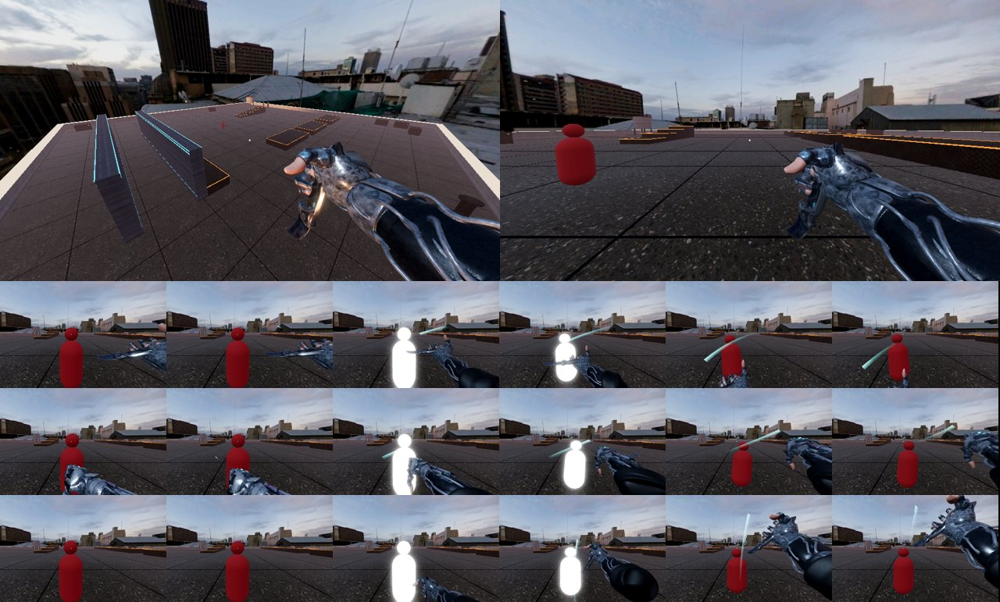
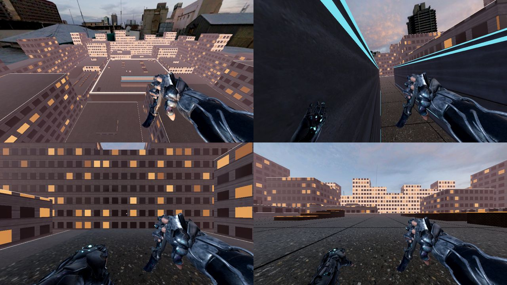
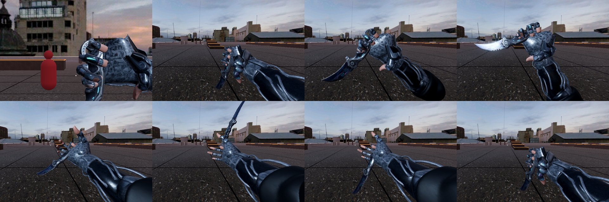

# Zuggle

一人称3Dのパルクール斬撃アクション。Godot 4.6（GDScript）。



## いまの到達点：M5 コンクリートジャングルとパルクール

### M5 コンクリートジャングルとパルクール



**街（`scripts/city.gd`）**：壁ジャンプをたくさん使えるよう、屋上をビルで囲んだ

- 屋上（x・z = -31〜31）のまわりを、幅4mの路地で区切った12棟のビルが囲む。その外を高さ18〜34mのビルの輪が閉じる
- ビルごとに屋上の高さを変えた（-2.5〜+24m）。高いビルの壁は壁走り・壁ジャンプ、低いビルの屋上は跳び移り先
- 路地の底は y=-6。落ちても死なず、路地の両側の壁を壁ジャンプで乗り継いで登り直せる（テストでは5回で屋上の手すりへ戻る）
- 屋上の手すり（高さ1.2m）に当たり判定を付けた。乗り越えて隣のビルへ跳べる。外周の見えない壁はなくした
- 西の低いビル（W_Bottom）は練習コース：W_Top から橋を渡り、坂を滑り降りて加速 → パイプ（下端1.1m）とダクト（下端1.15m、長さ6m）をスライディングでくぐる → 柵を乗り越える。別の柵2本で乗り越えの練習
- 屋上の小屋（高さ2.3〜2.6m）でよじ登りの練習
- ビルは窓付きのコンクリート（`materials/building.gdshader`）。夕方なので3割ほどの窓が暖色に灯る。屋上の縁は白、障害物の縁は橙に光る

**スライディング**（B / Ctrl / C）

- 地上で5 m/s以上なら滑る。体の高さを1.8→1.0m、目の高さを足から0.85mに下げる
- 始めに1.5 m/s加速（最高速度＋1.5 m/sまで。連打で無限に速くはならない）。5 m/s²で減速し、3 m/s未満か1.2秒で立つ
- 下り坂では重力で加速する（16度の坂で約4 m/s²）。上り坂では減速する
- 頭の上が塞がっている間は立たず、3 m/s以上を保って抜ける
- 滑りながらAでスライディングジャンプ。速さはそのまま跳ぶ
- 着地の少し前（0.2秒以内）に押しても、着地と同時に滑る

**乗り越え・よじ登り（左手）**：右手はナイフで埋まっているので、空いている左手で体を運ぶ

- 前の壁へ向かって（正面から50度以内）当たり、その上面が手の届く高さなら自動で上へ移る。ボタンは増やさない
- 足から1.25mまで：**乗り越え**（0.22秒）。走ってきた速さのまま柵を越える。地上からでも出る
- 足から2.3mまで：**よじ登り**（0.42秒）。跳んで縁に手が届いたとき。地上から高い段へは登らない
- 壁走り中にスティックを壁へ倒すと、手の届く高さの壁の上へよじ登る
- 上がった後は最低3 m/sで前へ進む。上に立つ場所がなければ登らない
- 左手（右手のモデルを左右反転）：乗り越えでは柵の上に手のひらをつき、よじ登りでは縁に指を掛けて押し下げる。左の壁で壁走りすると壁に手を添え、壁ジャンプでは壁を突き放す。スライディング中は低く構える。何もしないときは画面の外へ下げる
- 調整パネルに「スライディング」「乗り越え」「よじ登り」の10項目を追加

### M4 アナログ斬り

- **斬撃モード**：RT（キーボード・マウスでは右クリックかShift）を押している間、右スティックとマウスは視点ではなく斬撃に使う。画面中央に円とスティックの位置が出る
- **弾く**と斬る：スティックを中心付近（0.3未満）から外周（0.85以上）まで、受付時間（0.15秒）のうちに倒すと1回斬る。ゆっくり倒しただけでは出ない。1回弾いたら、中心へ戻すまで次は出ない（倒したままRTを押しても斬らない）
- **弾いた向きが斬る向き**：弾き始めから弾き終わりへの向き。通常攻撃の振りを視線の軸まわりに傾けて、その向きに振る。右へ斬るときは左から右の振りを使い、手首が裏返らないよう傾きは±90度に収める
- **弾く速さが強さ**：速さ ÷ 25（/秒）で強さ0〜1。強さで基本威力が0.8〜1.4、判定時間が0.14〜0.06秒になる（強いほど速く振り抜く）
- 威力 = 基本威力 × (1 + 現在の速度 / 最高速度)。最高速度で走りながら最速で弾くと2.8
- 斬った向きにダミーが流れる。振り下ろすほど強く潰れる
- マウスは仮想スティック：右クリックを押しながら素早く動かす（120pxで端まで、離すと中心へ戻る）
- 通常攻撃の途中で弾いても先行入力で出る
- 調整パネルに「アナログ斬り」の7項目を追加

### ダミー：訓練ロボット（Meshy製）

- 画面の顔と2本の柱の腕を持つ訓練ロボット。元のGLB（48万三角形・20.6MB）を `tools/dummy/shrink_glb.py` で4万三角形・テクスチャ1024pxの2.0MBに軽くした（形の誤差は大きさの0.16%）
- 高さ1.8mに合わせて置く。当たり判定は幅1.7・高さ1.8・奥行き1.2mの箱
- 当たると素材の上に半透明の白を重ねて光らせる（モデルを替えても光る）

軽くし直すとき：

```sh
pip install numpy pillow meshoptimizer
python3 tools/dummy/shrink_glb.py 元.glb models/dummy.glb 40000 1024   # 三角形の数、テクスチャの辺
```

### 見た目：夕方のビルの屋上（0.3.4-m3）

- 空はPoly Havenの夕景（sunset_jhbcentral）。床・壁・足場もPoly HavenのPBR素材（どれもCC0）
- 乗れる足場の縁は橙、壁走りできる壁は水色、外周の手すりは白く光る（`scripts/arena.gd` が起動時に付ける）
- 床に4m間隔の目地（走ると流れて速さが分かる）。外周に空調機・換気塔・給水タンク・点滅するアンテナ
- 外周の高い壁は見えない壁（層3）にした。壁走りと武器の引っ込めの対象にはならない（M5で街の外側 ±74.5 へ移し、屋上の手すりには当たり判定を付けた）
- 手とナイフは色テクスチャの水色・マゼンタの線を光らせ（`models/*_emission.png`）、手元だけを照らす補助光（ViewLight）を当てる

### ナイフの握りと眺め（0.3.5-m3）



- 握りは手の骨から毎回計算する（`Weapon._fit_to_hand`）。人差し指の付け根の節に輪を通し、中指〜小指が巻く空間に柄を通して、小指の側から刃を拳の前へ曲げて出す
- 親指は付け根を80度曲げて人差し指の側へ45度寄せ、拳に沿わせる（`thumb_grip`・`thumb_across`）
- 手首のひねりは前腕の軸まわり、手首の曲げは手首を中心に回す（前腕が画面に振り込まない）
- **ナイフ眺め**（Y / F、2.4秒）：手首を内へ曲げて刃の面を見せる → 手のひらを上へ返して裏の面 → 指を開いて人差し指を軸に2回転 → 握り直して手首を振り、構えへ戻る。途中で攻撃すると止めて振る。キーは `INSPECT_KEYS`

### ナイフのモーション（0.3.4-m3）

- 3連の型：①袈裟斬り（右上→左下）②逆袈裟（左下→右上）③突き上げ（前へ突いて上へ引っ掛ける）。振り終わってから0.5秒以内に押すと次の型、空くと①に戻る
- どの型も「振りかぶり → 中間を通る弧 → 行き過ぎ → ばねで構えに戻る」。型は `scripts/weapon.gd` の `PATTERNS`
- 振っている間は刃の通り道に水色の残光が出る（`TRAIL_*`）
- 視点を回すと手が遅れてついてくる・走ると揺れる・着地で沈む（`SWAY_*`・`BOB_*`・`LAND_KICK`）

### M3 ヒットラボ

- ダミー1体（スタート地点の左前）。HPはなく、当たった位置と斬った向きに応じて吹き飛び、よろけ、元の位置に戻る。当たると一瞬白く光る
- 通常攻撃（X / 左クリック / J）。振りかぶり→判定→戻りの3段。先行入力つき。1振りごとに右から・左からを入れ替える
- 威力 = 基本威力 × (1 + 現在の速度 / 最高速度)。止まっていれば1、最高速度なら2
- 当たった瞬間：ヒットストップ（威力1で50ms〜威力2で100ms）、画面揺れ（トラウマ値の2乗、ノイズで滑らかに、時間で減衰）、振動（弱いヒットは弱モーター、強いほど強モーター）、打撃音（毎回ピッチを少しずらす）、ダミーと手・武器の伸び縮み（体積を保って行き過ぎてから戻る）
- 当たり判定は見た目のメッシュを使わず、刃に沿わせた細長い箱（1.4m）で取る
- 目の前に壁があると武器を引っ込めてめり込みを防ぐ
- ダミーでは壁走りしない（壁走りは層1の地形だけ）
- 画面揺れと振動は調整パネルで0にすればオフ

### 手：Neon Cybernetic Hand（Meshy製、骨を自動で付けた）

- `models/hand.glb` には骨がないので、`tools/rig/` の手順で骨16本（手のひら＋指5本×3関節）と重みを付けて `models/hand_rigged.scn` にしている
- メカの手は部品が分かれているので、部品ごとに1本の骨へ固定した（関節で部品が曲がらない）
- 構えでは指を握り、カランビットを人差し指側の輪、刃を小指側から出して持つ
- 振りは肘（拳の後ろ0.35m）を中心に回す。前腕が画面を横切らない
- **ナイフ眺め**（Y / F）：刃の両面を見せてから、人差し指を軸に2回転させて握り直す（2.4秒）

骨を付け直すとき：

```sh
pip install numpy scipy
python3 tools/rig/analyze_hand.py                         # 関節の位置と頂点ごとの骨 → tools/rig/rig.json
godot --headless --path . res://tools/rig/build_hand.tscn # → models/hand_rigged.scn
```

指の曲げ角は `scripts/weapon.gd` の `CURL_GRIP`（握り）と `CURL_SPIN`（ナイフ回し）、親指は `thumb_grip`・`thumb_across` で変える。

### 武器：Neon Talon（Meshy製のカランビットナイフ）

`models/weapon.glb` はMeshyで作ったカランビット「Neon Talon」。`Hand` の設定でナイフの大きさにしている。

| 設定 | 値 | 意味 |
| --- | --- | --- |
| `flip_model` | オン | このモデルは長い辺の小さい側が刃先なので反転する |
| `model_length` | 0.32 m | 輪から刃先まで |
| `grip_back` | 0.09 m | 握る位置から輪の端まで |
| `hit_length` | 1.0 m | 判定の箱の長さ（剣のときは1.4m） |

クレジット：「Neon Talon」「Neon Cybernetic Hand」と訓練ロボット（ダミー） made with Meshy（CC BY 4.0）。空と床・壁の素材は Poly Haven（CC0）

### Meshyの武器に差し替える

1. MeshyのWeb版で刀を作り、GLB（Draco圧縮なし）で書き出す
2. `models/weapon.glb` という名前で置く。あれば起動時に箱の剣と差し替わる
3. 一番長い辺を刃の向きにそろえ、柄頭から刃先までを `model_length` に自動で縮める。長い辺の小さい側（立てて作った剣なら下）を柄とみなす
4. 柄と刃先が逆なら、`Player/Head/Camera3D/Hand` の `flip_model` をオンにする。握る位置と向きは `Hand/Swing/Grip` の位置と回転で微調整する
5. 当たり判定は箱のままなので、モデルを替えても手触りは変わらない
6. Free版で作ったモデルはCC BY 4.0。公開するときはクレジットを表記する

### M2 壁走り

- 空中で壁の横にいると自動で壁走りに入る（ボタンは増やさない）。進入時の速さを、向きだけ壁沿いに変えて保つ
- 入る条件：空中、水平速度が最低速度以上、壁との角度が上限以内（正面衝突では入らない）
- 壁走り中は少し上向きに入り、弱い重力で弧を描く。カメラは壁と反対側へ少し傾く（0でオフ）
- 抜け方：壁の端で勢いを保ったまま抜ける / 壁と反対へスティックを倒す / 着地する / 上限時間（初期値1.75秒）で落下
- 方向転換：進む向きと逆へスティックを倒す（視点を振り返って前に倒してもよい）と、壁沿いに減速して折り返し、元の速さまで戻る（約0.4秒）
- 壁ジャンプ：壁走り中にA。壁から離れる向き（5 m/s）と上（6 m/s）へ跳び、壁沿いの勢いは保つ。スティックを倒していればその向きへ跳ぶ（壁へ向けて倒しても壁からは必ず離れる）。壁を離れた直後もコヨーテタイムの間は跳べる
- 壁に入る前に押したジャンプでは、入った瞬間に壁ジャンプしない
- 同じ壁には着地するまで入り直さない
- 部屋の奥の長い壁に練習コースを追加（足場2つの間が6m。壁を走らないと届かない）
- 長い壁の裏に、4m離して平行な壁（JumpWall）を追加。壁ジャンプで左右の壁を乗り継ぐ練習用

### M1 移動

- 走り（加速・減速を別の値で設定）、ジャンプ、コヨーテタイム、先行入力、小ジャンプ
- 空中で入力を離しても水平速度が落ちない（大原則）
- 酔い対策：画面中央の点、視野角90度、目の高さのカメラ、控えめな頭の揺れ
- 調整パネル：手触りの値をすべてゲーム中のスライダーで変えられる

## 起動

Godot 4.6でこのフォルダを開き、F5で実行する。

## 操作

| 操作 | パッド（Xbox配置） | キーボード・マウス |
| --- | --- | --- |
| 移動 | 左スティック | WASD |
| 視点 | 右スティック | マウス / 矢印キー |
| ジャンプ / 壁ジャンプ | A | Space |
| スライディング | B | Ctrl / C |
| 乗り越え・よじ登り | 縁へ向かって走る・跳ぶ（壁走り中は壁へ倒す） | 同じ |
| 通常攻撃 | X | 左クリック / J |
| 斬撃モード（押している間） | RT | 右クリック / Shift |
| アナログ斬り | 斬撃モードで右スティックを弾く | 斬撃モードでマウスを素早く動かす |
| ナイフ眺め | Y | F |
| 調整パネルの開閉 | Back（View） | F1 |
| マウスを解放 / 再捕捉 | ― | Esc / クリック |

調整パネルを開いている間はプレイヤーが止まる。十字キーの上下で項目を選び、左右で値を動かす。
「値をコピー」で今の値をクリップボードに入れられるので、仕様書の改善ログに貼る。
決めた値は `scripts/tuning.gd` の初期値に書き戻す。

## テスト

```sh
tools/dev.sh check          # Godotがなければ入れる → 全スクリプトのlint → 5つのテストを並列
tools/dev.sh test hitlab    # 1つだけ回す（movement / wallrun / hitlab / slash / parkour）
tools/dev.sh shot views     # 実際に描画して build/shots/ に撮る（views / swing / parkour / look / grip / idle / compass）
tools/dev.sh bump 0.3.4-m3  # version/code を1つ上げ、version/name を変える
```

pushとプルリクエストのたびに GitHub Actions の「Test」が同じ `tools/dev.sh check` を回す。
Claude Codeでは `/check` で、落ちたテストを直して全部通るまで繰り返させられる。
クラウドのセッションでは開始時にGodotを自動で入れる（`.claude/settings.json` のSessionStartフック）。

1本ずつ直接回すなら：

```sh
godot --headless --path . res://tests/test_movement.tscn
godot --headless --path . res://tests/test_wallrun.tscn
godot --headless --path . res://tests/test_hitlab.tscn
godot --headless --path . res://tests/test_slash.tscn
godot --headless --path . res://tests/test_parkour.tscn
```

`test_movement` は走り・ジャンプ・先行入力・コヨーテタイム・空中の勢い・小ジャンプ、
`test_wallrun` は壁走りの開始・速度維持・弱い重力・上限時間・壁の端での抜け・正面衝突と低速では入らないこと・スティックで離れること・練習コースの踏破・方向転換・壁ジャンプ（向き・スティックでの向き・向かいの壁への乗り継ぎ・入る前の押しでは跳ばないこと・壁のコヨーテタイム）、
`test_hitlab` は通常攻撃が当たること・ナイフ回し（2回転して元に戻る・攻撃で止まる）・手の骨と重み・1振り1回・ヒットストップの長さ・画面揺れの減衰・ダミーの吹き飛びと戻り・空振り・速度による威力・攻撃の先行入力・壁の前で武器を引っ込めること・ダミーで壁走りしないこと・3連の型が進んで戻ること・輪が人差し指にかかり刃が小指の側から前へ出ることを確かめる。
`test_slash` は斬撃モードで視点が止まること・弾くと斬って当たること・ゆっくり倒しても斬らないこと・弾いた向き（水平・振り下ろし・斬り上げ）・速い弾きほど強いこと・中心へ戻すまで次が出ないこと・走る勢いも威力になること・マウスでの弾き・通常攻撃中の先行入力を確かめる。
`test_parkour` は街（12棟・路地の幅・路地の底）・スライディング（加速・目の高さ・減速・立ち上がり・低速では出ない・スライディングジャンプ）・立ったままではパイプをくぐれないこと・スライディングでパイプとダクトを抜けること・坂での加速・乗り越え（速さを保つ・左手を柵につく）・よじ登り（左手を縁に掛ける・上に立つ）・地上からは高い段に登らないこと・壁走りから壁の上へ・壁走り中の左手（左の壁だけ）・路地から壁ジャンプを乗り継いで屋上へ戻ることを確かめる。
失敗があると終了コード1で終わる。

## APKの書き出し

### GitHub Actionsでリリースする（ふだんはこちら）

`.github/workflows/release-apk.yml`。GitHubのActions画面で「Release APK」→「Run workflow」を押し、ブランチを選んで実行する。
lintと自動テスト（`tools/dev.sh check`）を通してからAPKを書き出し、`export_presets.cfg` の `version/name` を名前にしたリリース（例：`v0.3.2-m3`）に載せる。
同じ名前のリリースがあればAPKを差し替える。main以外から出したものはプレリリースになる。

署名鍵はリポジトリに入れず、Settings → Secrets and variables → Actions に登録する。

| Secret | 中身 |
| --- | --- |
| `ANDROID_KEYSTORE_BASE64` | キーストアをbase64にしたもの（`base64 -w0 zuggle-release.keystore`） |
| `ANDROID_KEYSTORE_PASSWORD` | キーストアと鍵のパスワード（同じものにする） |
| `ANDROID_KEY_ALIAS` | 鍵の別名 |

鍵は一度だけ手元で作る：

```sh
keytool -genkeypair -keystore zuggle-release.keystore -alias zuggle -keyalg RSA -keysize 2048 -validity 10000 -dname "CN=Zuggle"
```

Secretsがなければ、リポジトリに入れた固定のデバッグ鍵 `tools/debug.keystore`（別名androiddebugkey、パスワードandroid）で署名する。
デバッグ鍵は公開して構わない種類の鍵で、毎回同じ鍵なので上書きインストールできる。いまはこちらを使っている。

### 手元で書き出す

Android SDK・JDK 17以上・Godot 4.6.1のエクスポートテンプレートを用意し、`tools/build_apk.sh` を実行する（ワークフローと同じ処理）。

```sh
export GODOT=/path/to/godot ANDROID_HOME=/path/to/Android/Sdk JAVA_HOME=/path/to/jdk
export ANDROID_KEYSTORE_BASE64=$(base64 -w0 zuggle-release.keystore) ANDROID_KEYSTORE_PASSWORD=... ANDROID_KEY_ALIAS=zuggle
tools/build_apk.sh   # build/zuggle-<version>.apk ができる
```

更新版を上書きインストールするには同じ鍵で署名し、`export_presets.cfg` の `version/code` を1つ上げる。
鍵をなくすと上書きできなくなり、一度アンインストールが必要になる。

## 構成

| パス | 役割 |
| --- | --- |
| `scenes/main.tscn` | 屋上（段差・隙間・壁走り用の長い壁と練習コース）、街、プレイヤー、両手と武器、ダミー、HUD |
| `scripts/player.gd` | 一人称プレイヤーの移動・壁走り・スライディング・乗り越え・よじ登りとカメラ（画面揺れを含む） |
| `scripts/left_hand.gd` | 左手。乗り越え・よじ登り・壁走り・壁ジャンプ・スライディングで縁・壁・床へ手を伸ばす |
| `scripts/city.gd` | 屋上のまわりの街（ビル・路地・外周のビル・練習コース）を表から作る |
| `materials/building.gdshader` | 窓付きのコンクリートのビル |
| `scripts/weapon.gd` | 手と武器。通常攻撃とアナログ斬りの振り・当たり判定・伸び縮み・壁へのめり込み防止・Meshyモデルの読み込み |
| `scripts/dummy.gd` | ダミー。ばねで吹き飛び・よろけ・伸び縮みして戻る |
| `scripts/flick_detector.gd` | 右スティックの弾きを見つける（向きと速さ） |
| `scripts/slash_hud.gd` | 斬撃モードの円・スティックの位置・斬った向きの線 |
| `models/dummy.glb` | ダミーの見た目（Meshy製の訓練ロボットを軽くしたもの） |
| `tools/dummy/shrink_glb.py` | GLBのポリゴンとテクスチャを減らす |
| `scripts/hit_feel.gd` | 自動読み込みの `HitFeel`。威力の計算・ヒットストップ・振動・効果音 |
| `models/` | Meshyで作った `weapon.glb` を置く場所 |
| `tools/build_apk.sh` | APKの書き出し（署名鍵の有無で署名を切り替える） |
| `tools/rig/` | 手のモデルに骨と重みを付ける（`analyze_hand.py` → `build_hand.tscn`） |
| `models/hand_rigged.scn` | 骨入りの手（`tools/rig/` で作る） |
| `.github/workflows/release-apk.yml` | テスト→APK書き出し→GitHubのリリース |
| `scripts/tuning.gd` | 調整値（自動読み込みの `Tuning`）。`SPECS` に足すとスライダーも増える |
| `scripts/debug_ui.gd` | 調整パネル |
| `scripts/arena.gd` | パルクール場の飾り（光る縁・床の目地・外周の小物） |
| `materials/`・`textures/env/` | 床・壁・足場の素材と空 |
| `tools/shot/` | スクリーンショット（`tools/dev.sh shot`） |
| `tests/` | 自動テスト |
| `tools/dev.sh` | Godotの導入・lint・テスト・版上げをまとめたコマンド |
| `tools/lint.tscn` | 全スクリプトを読み込んで文法・型のエラーを出す |
| `.github/workflows/test.yml` | push・プルリクエストごとのlintとテスト |
| `.claude/` | セッション開始時のGodot導入フックと `/check` スキル |

## Claude CodeとGodot MCP

```sh
claude mcp add godot -- npx @coding-solo/godot-mcp
```
